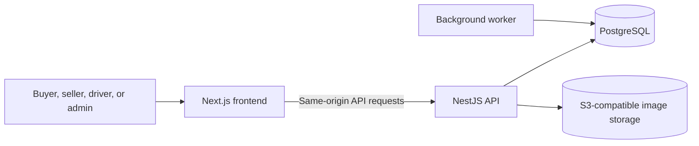

# Burhanpedia

An e-commerce marketplace for discovering products, shopping across independent stores, and managing orders from purchase through delivery.

Burhanpedia brings buyers, sellers, and delivery drivers into one connected experience. Buyers can compare products and variants, place multi-store orders, follow deliveries, and review completed purchases. Sellers manage their storefronts and orders, while drivers handle available deliveries.

[Features](#features) · [Demo](#demo) · [How it works](#how-it-works) · [Technology](#technology) · [Get started](#get-started) · [Documentation](#documentation)

## Features

| Experience | What it provides |
| --- | --- |
| Shopping | Searchable product catalog, category browsing, store discovery, product variants, and a server-side cart. |
| Checkout | Address selection, delivery options per store, voucher validation, server-calculated prices, and order tracking. |
| Storefronts | Seller-managed store details, logos, products, variants, stock, and order processing. |
| Delivery | Driver assignment, delivery progress, status history, and overdue-order handling. |
| Reviews | Reviews from buyers of completed orders, with product and store rating summaries. |
| Administration | Role-aware administrative views and operational controls. |

## Demo

The recordings below show the application with demonstration data. They contain no narration or overlays.

### Browse the marketplace

https://github.com/user-attachments/assets/7ca6615c-5da3-4688-9ddb-84ed908af96f

### Cart and checkout

https://github.com/user-attachments/assets/8cd7f68c-731c-4434-a25f-0782e071d29c

### Seller workspace

https://github.com/user-attachments/assets/3808d62a-498c-44ad-9faf-fb2af5c52760

### Driver delivery flow

https://github.com/user-attachments/assets/408d544e-e2d1-46a0-be33-e9fa24a757e7

### Buyer reviews

https://github.com/user-attachments/assets/ce3635a1-09c9-4740-9d14-18f71066b838

### Administration

https://github.com/user-attachments/assets/41c2b1bd-b044-4228-bf44-37e2a7cbdfc0

## How it works



The frontend presents the marketplace and calls the API through a same-origin proxy. The API handles identity, permissions, catalog changes, pricing, checkout, and order transitions. PostgreSQL stores application data; a separate worker processes scheduled order tasks and outbox events. Product and store images use S3-compatible object storage. See the [frontend](frontend/README.md) and [backend](backend/README.md) guides for implementation details.

## Technology

| Technology | Role in the project |
| --- | --- |
| Next.js, React, TypeScript | Storefront and role-specific web application. |
| TanStack Query | Server-state fetching and cache management in the browser. |
| Tailwind CSS | Responsive interface styling. |
| NestJS, TypeScript | HTTP API, authentication, validation, and marketplace workflows. |
| PostgreSQL and `pg` | Persistent data, SQL queries, transactions, and versioned migrations. |
| Docker Compose | Local PostgreSQL and MinIO services. |
| S3-compatible storage / MinIO | Product and store image uploads. |
| Jest and Playwright | Backend tests and end-to-end browser tests. |

The frontend and backend are separate projects in this repository, each with its own `package.json`, lockfile, and build. No root workspace or shared source package is required.

## Get started

Requirements: Node.js 22–24 and Docker Compose. Copy `backend/.env.example` to `backend/.env` and `frontend/.env.example` to `frontend/.env.local`. Check that `DATABASE_URL` points to the intended local database before running a migration or seed command.

Start PostgreSQL and the API from `backend/`:

```bash
docker compose up -d --wait postgres
npm ci
npm run db:migrate
npm run db:seed
npm run start:dev
```

Start the web application from `frontend/` in a second terminal:

```bash
npm ci
npm run dev -- -p 3001
```

Open `http://localhost:3001`. The frontend forwards `/api/v1` requests to the API at `http://localhost:3000`. Run `npm run worker:dev` from `backend/` in another terminal for background processing. Image uploads additionally require MinIO; setup instructions are in the [backend guide](backend/README.md).

To populate a larger local showcase, run `npm run db:seed:demo` from `backend/`. Never use demonstration seeds on a production database.

## Documentation

- [Frontend architecture, configuration, and tests](frontend/README.md)
- [Backend architecture, database, worker, and operations](backend/README.md)
- [Third-party image acknowledgements](frontend/ACKNOWLEDGEMENTS.md)

## Project scope

The included wallet top-up is for development and demonstration; it is disabled in production. A real payment or wallet-funding integration is required before accepting public paid orders. Production operation also requires deployment-specific database, storage, backup, monitoring, and recovery procedures.
