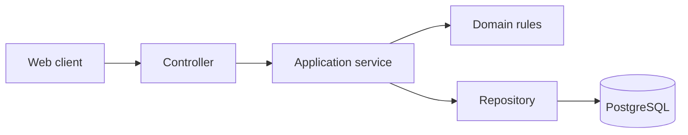

# Burhanpedia API and worker

The backend provides Burhanpedia's HTTP API and background processing. It owns marketplace data and business rules, from account access and product management to checkout, delivery, and reviews. It can be installed, tested, and built independently of the frontend.

## Architecture

The API is organized by business capability. Each feature module in `src/modules/` has a clear path from an incoming request to a database operation:



Controllers accept and validate requests. Application services coordinate the work. Domain rules handle decisions such as pricing and allowed status changes. Repositories keep SQL and data mapping out of the HTTP layer. Shared database code is in `src/database/`.

| Module | Responsibility |
| --- | --- |
| `identity` | Registration, cookie-based sessions, rotating refresh tokens, active roles, and audit records. |
| `catalog` | Public search and discovery, stores, variants, inventory, and seller product management. |
| `storage` | Signed S3-compatible uploads and image validation before publication. |
| `commerce` | Server-side cart, deterministic pricing, wallet ledger, vouchers, checkout, and order creation. |
| `operations` | Seller order processing, driver assignment and delivery states, admin operations, and time controls for development. |
| `reviews` | Verified buyer reviews and rating summaries. |

The backend checks permissions and resource ownership on every protected action. Hiding a control in the frontend does not grant or remove access. Requests are validated and rate-limited; responses use a consistent error format and carry a request ID for troubleshooting.

### Database

PostgreSQL stores accounts, stores, products, carts, orders, delivery records, and background jobs. Schema changes are kept as numbered SQL files in `database/migrations/` and applied with `npm run db:migrate`. The migration command records what has run, verifies that applied files have not changed, and prevents two migration processes from changing the schema at once. Repositories use parameterized SQL through `pg`; related writes use transactions.

### Checkout

1. The buyer selects an address and a delivery method for each store in the cart.
2. The API checks the cart, stock, voucher, and wallet balance, then calculates the price. It does not accept a total supplied by the browser.
3. Checkout creates the payment record, per-store orders, inventory reservations, and wallet ledger entries in one transaction. If the operation fails, none of those changes are committed.
4. An idempotency key lets the buyer retry the same request without creating a second charge or order.

### Background worker

The worker starts from `src/worker.ts` and runs separately from the HTTP API. It picks up scheduled jobs and outbox events stored in PostgreSQL. Its current work includes handling delivery deadlines and returning or refunding overdue orders. Failed work is retried; work that exhausts its attempts is recorded for investigation. The API can answer requests without the worker, but scheduled processing requires a running worker process.

## Local setup

Use Node.js 22–24 and Docker Compose. Copy `.env.example` to `.env` and review `DATABASE_URL` before every migration, seed, reset, or test command. The default Compose file provides PostgreSQL and optional MinIO with persistent local volumes.

```bash
docker compose up -d --wait postgres
npm ci
npm run db:migrate
npm run db:seed
npm run start:dev
```

The API listens at `http://localhost:3000/api/v1` by default. In another terminal, run `npm run worker:dev` to start background processing. To use seller image uploads, start object storage:

```bash
docker compose up -d --wait minio minio-init
npm run smoke:storage
```

Configure the `S3_*` variables from `.env.example`. The API issues a signed upload URL and checks the uploaded image before it can appear in the catalog. `npm run db:seed:demo` adds a larger demonstration dataset on top of the development seed; it is not production data.

## Configuration and verification

The main environment settings in `.env.example` cover PostgreSQL (`DATABASE_*`), sessions (`JWT_*` and `COOKIE_SECURE`), browser origins (`FRONTEND_URL` and `ADDITIONAL_ORIGINS`), and image storage (`S3_*`). Required production secrets are checked at startup. Keep credentials outside version control.

```bash
npm run lint
npm run typecheck
npm test -- --runInBand
npm run build
npm run audit:dead-code
npm run audit:dependencies
```

Database and HTTP integration tests require a dedicated PostgreSQL test database. `npm run test:e2e` runs backend endpoint tests; `npm run db:verify` checks schema and seed data. The [integration CI workflow](../.github/workflows/integration-ci.yml) shows the combined test setup. Never run seed, reset, benchmark, or test commands against a production database.

## Production runtime and limitations

Run migrations as a separate deployment step using a direct PostgreSQL connection. Deploy the built API with `npm run start:prod` and the worker with `npm run worker` as separate processes. Configure secure cookies, a strong JWT secret, the public frontend origin, PostgreSQL backups, and S3-compatible image storage. Rehearse restore and rollback before release.

For a Vercel API deployment, set the project root to `backend/`. `vercel.json` selects the NestJS framework; do not configure a static `public` output directory. Vercel hosts the HTTP API as a function, not the continuously running worker. The worker needs a separate process host and access to the same PostgreSQL database.

Production checkout requires a payment or wallet-funding integration. The included development wallet top-up and simulated time controls are unavailable when `NODE_ENV=production`.
